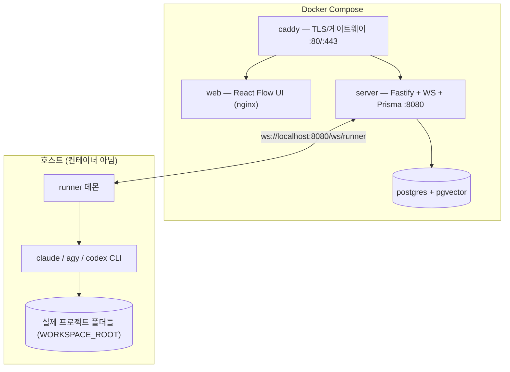
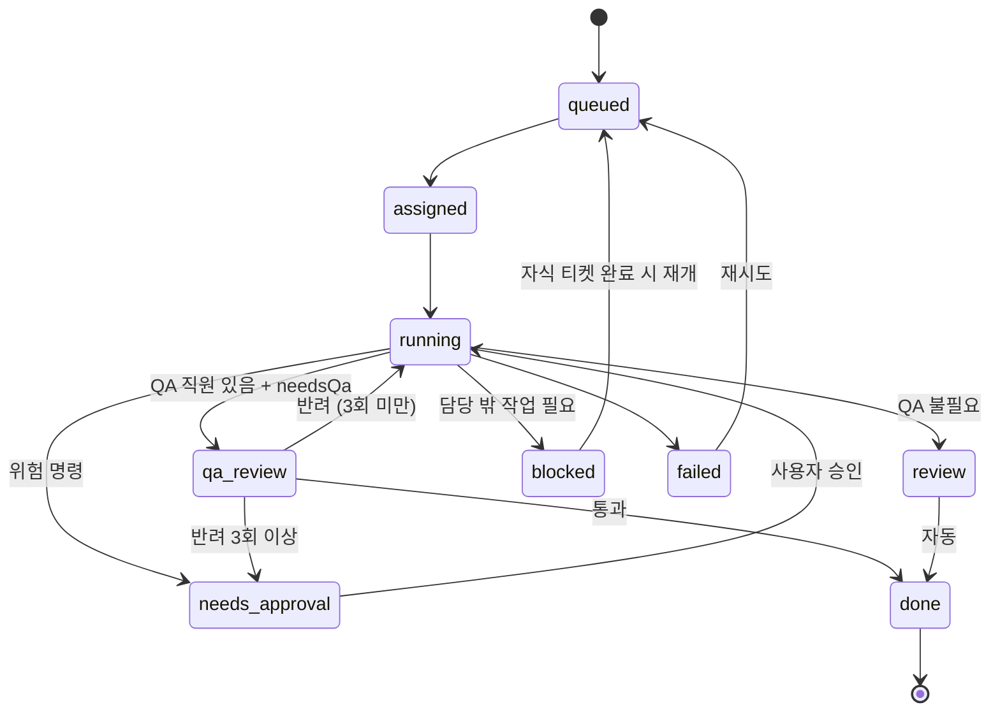
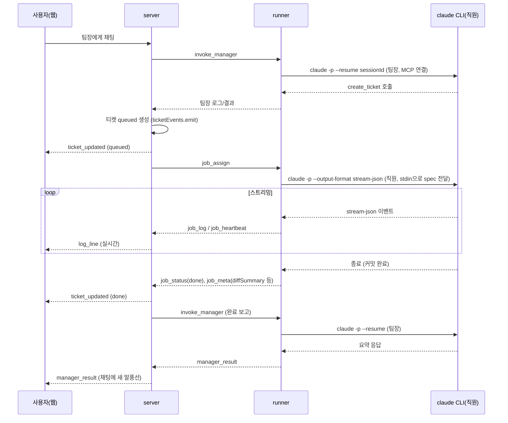

[지난 포스트](/posts/ai-crew-intro)에서 ai-crew가 왜 필요했는지 다뤘다. 이번엔 실제로 어떻게 짜여 있는지 — 모노레포 구성, 배포 토폴로지, 티켓 하나가 큐에 들어가서 완료될 때까지 거치는 경로를 정리한다.

---

## 모노레포 구성

pnpm workspace 하나에 서버·프론트·러너·공유 타입이 다 들어있다. 혼자 개발하고, 서버·UI·러너가 티켓/이벤트 타입을 공유해야 해서 레포를 쪼갤 이유가 없었다.

| 패키지 | 역할 | 주요 의존성 |
|---|---|---|
| `apps/server` | Fastify REST + WebSocket, 티켓 상태머신, MCP 서버 | fastify 5, @modelcontextprotocol/sdk, Prisma, pgvector, @xenova/transformers |
| `apps/web` | 조직도 UI | React 18, @xyflow/react(React Flow), zustand, Tailwind |
| `runner` | 호스트에서 CLI 프로세스를 실제로 스폰하는 데몬 | cross-spawn, ws |
| `packages/shared` | Ticket/Employee/Team/이벤트 타입 | — |
| `agents/manager.md` | 팀장 고정 시스템 프롬프트 | — |

---

## 배포 토폴로지 — Docker 넷 + 호스트 하나

`runner`만 컨테이너 밖, 호스트에서 직접 돈다. 이유는 명확하다 — 직원이 실제로 작업할 프로젝트들은 Spring Boot(Gradle), React Native, React 등 제각각이고, 그 프로젝트의 `gradlew`/`npm`/JDK/Node 툴체인이 호스트에 이미 설치되어 있다. 이걸 컨테이너 안에서 재현하려면 Docker-out-of-Docker나 툴체인 이미지를 프로젝트 스택 수만큼 관리해야 하는데, 그 복잡도를 감당할 이유가 없었다. 러너가 호스트 프로세스로 `claude`/`agy`/`codex` CLI를 그대로 스폰해서 기존 툴체인을 그대로 쓰는 쪽을 선택했다.

`postgres`는 `pgvector/pgvector:pg16` 이미지를 쓴다 — 팀 기억(RAG) 때문에 벡터 컬럼이 필요해서다.

---

## 티켓 상태머신

`review`는 사람이 눌러야 하는 승인 게이트가 아니다. 직원이 이미 프로젝트의 실제 브랜치에 커밋까지 끝낸 상태라, 별도로 머지할 것도 없어서 그냥 자동으로 `done`으로 넘어간다. 진짜 사람 개입 지점은 `needs_approval` 하나뿐 — 위험한 명령(`git push` 등)을 실행하기 직전이거나, QA가 같은 티켓을 3번 연속 반려했을 때다.

`blocked`가 이 시스템의 핵심 메커니즘이다. 직원이 자기 담당 밖의 작업이 필요하다고 판단하면 `report_blocked` 툴을 호출하고, 티켓은 즉시 `blocked`로 바뀐다. 서버가 자동으로 팀장을 깨우고, 팀장은 `parentTicketId`를 걸어 다른 직원에게 새 티켓을 발행한다. 그 자식 티켓이 `done`에 도달하면 원래 막혀있던 티켓이 자동으로 `queued`로 돌아가 재개된다.

---

## WebSocket 두 채널 — UI용과 러너용을 분리한 이유

서버는 WS 엔드포인트를 두 개 연다.

- **`/ws/ui`** — 브라우저 클라이언트. 서버 → 브라우저 단방향(`ticket_updated`, `log_line`, `manager_log`/`manager_result` 등). 브라우저가 뭘 하고 싶으면(승인, 채팅) REST로 보내고, REST 핸들러가 직접 `broadcastToUi`를 호출한다.
- **`/ws/runner`** — 러너 프로세스 정확히 하나가 붙는다. 양방향(`job_assign`/`job_cancel`/`invoke_manager` ↔ `job_log`/`job_status`/`job_heartbeat`).

### 티켓 하나가 큐에서 완료까지 가는 경로

두 가지 세부사항이 눈에 띈다.

1. **팀장 프롬프트/작업 지시는 CLI 인자가 아니라 stdin과 임시 파일로 전달한다.** Windows에서 커맨드라인 인자가 깨지는 문제를 실제로 겪은 뒤 바꾼 방식이다 (`--append-system-prompt-file`, `--mcp-config`에 임시 파일 경로를 넘긴다).
2. **`ticketEvents` 리스너가 단일 지점이다.** 티켓 상태가 바뀌면 이 한 곳에서만 UI 브로드캐스트와 러너로의 큐 전달을 둘 다 처리한다. 처음엔 이 로직이 여러 군데 흩어져 있어서 "REST로 승인해도 UI가 안 바뀌는" 버그가 났었다 — 이후 한 곳으로 합쳤다.

---

## 팀장/직원에게 물린 MCP 툴

| 대상 | 툴 | 역할 |
|---|---|---|
| 팀장 | `list_projects`, `list_employees`, `create_ticket`, `get_ticket`, `list_tickets`, `revise_ticket`, `schedule_ticket_retry`, `create_planning_doc`, `create_project`, `search_history`, `ask_user` | 위임·조회·에스컬레이션 전담. 코드 수정 툴은 없음 |
| 직원 | `report_blocked`, `list_employees`, `ask_peer`, `ask_employee`, `answer_peer_message` | 담당 밖 작업 보고, 동료 간 질문/응답 |

직원에게는 의도적으로 `create_ticket`이 없다. 프로젝트 간 에스컬레이션은 반드시 `report_blocked`를 거쳐 팀장을 통하게 만든 것 — 직원끼리 마음대로 서로에게 일을 떠넘기지 못하게 하는 장치다. 사소한 질문(필드명 확인 같은)은 `ask_peer`(비동기, 응답을 기다리지 않음)로 처리하고, 실제 코드를 봐야 확인 가능한 질문은 `ask_employee`(동기, 최대 20분 타임아웃으로 상대 프로젝트에서 읽기 전용 조사 세션을 띄움)로 나뉜다.

---

## 비용을 줄이는 장치들

- **세션 재사용**: `(직원, 프로젝트)` 조합마다 세션 ID를 디스크에 남겨서, 같은 프로젝트에 반복 위임할 때 "코드베이스 전체를 다시 읽는" 비용을 매번 새로 지불하지 않는다.
- **팀 기억(RAG)**: 완료된 티켓/승인된 기획서를 `@xenova/transformers`로 로컬 임베딩해 Postgres(pgvector)에 저장한다. 팀장의 컨텍스트가 오래돼 압축된 뒤에만 `search_history`로 보조 검색한다 — 평소엔 안 쓴다.
- **티켓 세분화 억제**: 팀장 프롬프트에 "같은 직원·같은 프로젝트의 연속 작업은 티켓 하나로 묶어라"가 명시돼 있다. 티켓 하나마다 세션+QA+보고 사이클이 통째로 돌기 때문에, 한 요청이 8개 티켓으로 쪼개져 8배 비용이 든 실제 사례가 있었다.

---

➡️ 시리즈 인덱스: [AI 직원 팀 ai-crew를 만든 이유](/posts/ai-crew-intro)
