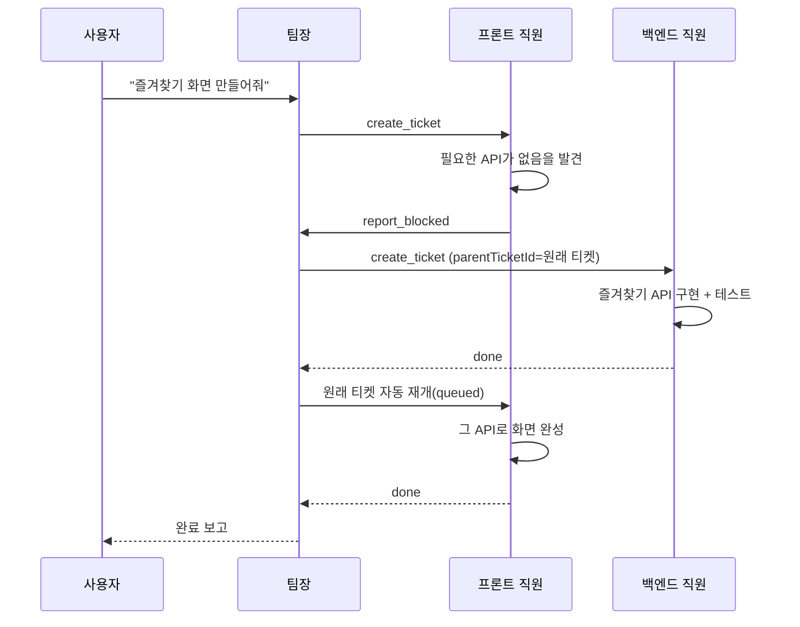

[아키텍처 편](/posts/ai-crew-architecture)에서 완성된 구조를 봤다면, 이번엔 거기 도달하기까지의 과정이다. ai-crew는 2026년 7월 30일부터 8월 5일까지, 6일 동안 83개 커밋으로 만들어졌다. 처음부터 이 구조였던 건 아니고, 실제로 7개 프로젝트를 대상으로 돌려보면서 여러 번 방향을 틀었다.

---

## Day 1 — 스테이지별 MVP

계획 단계에서부터 0~7단계로 스테이지를 나눠뒀다(`docs/PLAN.md`). 첫날 하루 만에 MVP 뼈대가 다 세워졌다.

- **0단계 스캐폴딩**: pnpm 모노레포, docker-compose, Prisma 스키마
- **1단계 티켓 백본**: mock 드라이버로 티켓 상태머신 + 러너 WS 채널부터 검증
- **2단계 팀장 연결**: MCP 툴 + headless Claude 호출
- **3단계 백엔드 직원**: git worktree 격리 + claude 드라이버로 실제 커밋까지
- **4단계 조직도 UI**: 매니저/직원 노드, 채팅, 승인 다이얼로그
- **6단계 blocked 에스컬레이션**: `report_blocked` → 팀장 자동 호출 → `parentTicketId` 자식 티켓 → 완료 시 원래 티켓 자동 재개. **puppynote-front-app에 "즐겨찾기 화면"을 시켜서 실전 검증** — 필요한 백엔드 API가 없어 blocked → 팀장이 puppynote-server에 백엔드 티켓 발행 → API 구현+테스트 통과 → 프론트 티켓 자동 재개.

- **7단계(원래 계획 밖 확장)**: 직원을 파일(`agents/*.md`) 대신 이름 기반 DB 모델로 전환해 웹에서 자유롭게 추가/삭제할 수 있게 만들었다. 애초 계획에는 없던 확장이지만, 직원을 코드/파일로 관리하는 게 실사용에서 너무 번거롭다는 걸 바로 느꼈다.
- **5단계(외부 노출)는 스킵**했다. Cloudflare Tunnel + 로그인까지 계획엔 있었지만, 로컬 전용 사용으로 충분하다고 판단했다.

---

## Day 2 — 윈도우 디버깅 마라톤

둘째 날은 대부분 `debug:`/`diag:` 커밋이었다. 맥에서 검증된 구조를 윈도우에서 돌리자 팀장의 stdout이 파싱되지 않는 문제가 났고, 여러 커밋을 거쳐 원인을 찾았다.

> 근본 원인: `&&`로 체이닝된 dev 스크립트가 윈도우에서 셸 이중 중첩을 유발.

같은 날 함께 고친 것들:
- CLI 인자로 프롬프트/설정을 넘기면 윈도우에서 인코딩이 깨지는 문제 → **stdin + 임시 파일** 방식으로 전환 (`--append-system-prompt-file`, `--mcp-config`에 임시 파일 경로 전달)
- `/`로 시작하는 채팅 메시지가 claude CLI의 슬래시 커맨드로 오인되는 버그 수정
- 채팅 이미지 첨부 + `ask_employee` 기능을 한 번 추가했다가(`21f7614`) 스코프 조정을 위해 되돌림(`d4de0e4`)

### 워크트리 격리를 버린 결정

원래 계획은 직원마다 git worktree를 새로 만들어 격리된 브랜치에서 작업시키는 것이었다(3단계에서 실제로 구현까지 했다). 하지만 실사용 중 워크트리 관련 버그가 반복되자, 격리를 버리고 **직원이 프로젝트 실제 폴더의 현재 체크아웃된 브랜치에 직접 작업하고 직접 커밋**하는 방식으로 피벗했다(`fa9fc14`).

트레이드오프는 명확하다 — 같은 프로젝트에 티켓 두 개가 동시에 돌면 서로 파일을 건드릴 수 있다. 그 대신 워크트리 생성/정리/충돌 처리에 들어가던 복잡도를 통째로 들어냈고, 대신 "같은 프로젝트엔 티켓을 동시에 하나만"이라는 규칙(프로젝트 단위 락)으로 단순하게 막았다. 격리를 코드로 보장하는 대신 스케줄링으로 회피한 셈이다.

---

## Day 3-4 — 협업 프리미티브

- 팀장에게 프로젝트 코드 **읽기 전용** 접근 권한 부여
- `ask_employee`(동기, 상대 프로젝트에서 실제 코드를 확인하는 조사 세션) 추가 — "백엔드가 프론트가 안 보는 화면 기준으로 엉뚱한 API를 만든" 실제 사고 이후, 화면 기준 요청은 첫 담당자가 반대편에게 먼저 확인하고 시작하도록 팀장 프롬프트에 명시
- 직원별 **담당 프로젝트 스코프** 도입 — 스코프 밖 티켓 생성 시 서버가 403으로 거부하며 실제 담당 목록을 알려줌
- 직원 이름을 팀 전역이 아니라 **팀 내부에서만 유일**하도록 변경 — 여러 팀에서 같은 이름을 쓸 수 있게
- 티켓을 과도하게 쪼개지 말라는 지침 + 티켓별 `needsQa` 선택제 도입 — 한 요청이 8개 티켓으로 쪼개져 비용이 8배 든 사례 이후

---

## Day 5 — 드라이버 일반화

- **Gemini CLI → Antigravity CLI(`agy`) 전환.** Gemini 무료 티어(`oauth-personal`)가 서비스 종료되면서 `IneligibleTierError`가 났고, 대체할 CLI로 옮겼다.
- `(직원, 프로젝트)` 조합별 **세션 재사용** 도입 — 반복 위임 시 코드베이스 재분석 비용을 줄임
- 팀장 자신도 팀별로 driver/model을 선택할 수 있게 일반화(직원과 동일한 구조로)
- 기획(planning) 기능도 Claude 전용에서 driver-agnostic으로 확장

---

## 실전에서 걸려 넘어진 버그들

README에 정리해둔 실제 트러블슈팅 목록 중 몇 가지.

**`job_meta` 이벤트 처리 버그** — 러너가 보낸 이벤트 객체를 그대로 구조 분해해서 Prisma `update()`에 넘기다 보니 이벤트의 `type` 필드까지 섞여 들어가 조용히 실패했다. `worktreePath`/`sessionId`가 저장 안 되는데 에러도 안 났다. 필드를 명시적으로 골라 뽑는 걸로 수정.

**티켓 상태 전이 경쟁 조건** — 러너 재연결 시 실행하는 `recoverAndAssign`과 직원의 상태 보고가 동시에 같은 티켓을 건드리면서 전이가 씹혔다. 티켓 단위 락(`withTicketLock`)과 멱등 배정 함수(`ensureAssigned`)로 해결.

**React Flow `fitView`는 최초 마운트 때만 적용됨** — 비동기로 나중에 로드되는 직원 노드가 화면 밖으로 잘려 나갔다. 노드 개수가 바뀔 때마다 `useReactFlow().fitView()`를 다시 호출하도록 수정.

**zustand 선택자가 안정적인 함수 참조라 리렌더링이 안 됨** — `statusForRole` 같은 헬퍼 함수 자체를 구독하면, 그 함수가 반환하는 데이터가 바뀌어도 리렌더링이 트리거되지 않는다. 데이터 객체를 직접 구독하도록 수정.

**승인해도 실제로 머지가 안 됨** — `review → done` 승인이 상태값만 바꾸고 워크트리 브랜치를 메인에 머지하지 않아서, 완료된 작업이 다른 티켓에서 안 보였다. (이 버그 자체가 나중에 워크트리를 버리는 결정에 힘을 보탰다.)

**재개된 티켓이 워크트리 충돌로 영구 정지** — blocked였다가 재개된 티켓이 같은 id로 워크트리를 다시 만들려다 "브랜치 이미 존재" 에러로 실패, 아무도 상태를 안 바꿔서 `running`에 영원히 멈췄다. 기존 워크트리를 재사용하도록 수정하고, 드라이버가 예외로 죽으면 반드시 `failed`로 보고하는 안전망을 추가했다.

---

## 돌아보면

일주일 동안의 궤적을 한 줄로 요약하면: **계획대로 만들고(Day 1) → 실제 환경(윈도우)에 맞춰 깨진 걸 고치고(Day 2) → 실사용하면서 과한 설계(워크트리 격리)를 걷어내고 → 협업 프리미티브와 비용 통제 장치를 실전 사고 이후에 하나씩 추가**했다. 처음 설계한 그대로 끝까지 간 부분은 오히려 적다 — 팀장을 프레임워크 없이 Claude Code로 구현한다는 핵심 결정 정도만 원안 그대로 남았다.

---

➡️ 시리즈 인덱스: [AI 직원 팀 ai-crew를 만든 이유](/posts/ai-crew-intro)
