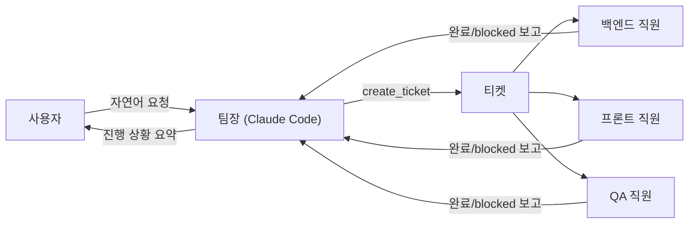

Claude Code 하나로 사이드 프로젝트를 여러 개 굴리다 보니 매번 같은 패턴을 반복하고 있었다. 터미널을 열고, 어느 프로젝트인지 확인하고, 컨텍스트를 설명하고, 작업을 시키고, 결과를 확인한다. 프로젝트가 7개면 이 사이클을 7번 반복한다.

그래서 "회사"를 하나 만들기로 했다. 팀장 1명이 요청을 받아 작업을 쪼개고, 적합한 직원에게 티켓으로 위임하고, 사람은 조직도 UI에서 실시간으로 진행 상황을 보다가 필요할 때만 개입하는 구조다. 이 포스트는 그 배경과 핵심 개념을 정리하고, 시리즈 전체의 인덱스 역할을 한다.

---

## 왜 오케스트레이션 프레임워크를 안 썼나

LangGraph나 CrewAI 같은 멀티 에이전트 프레임워크를 검토하지 않은 건 아니다. 하지만 결론은 "필요 없다"였다. 이유는 단순하다 — **팀장 역할을 맡을 게 이미 Claude Code이기 때문**이다.

> 팀장이 Claude Code이므로 작업 분해·툴 호출·서브에이전트 루프가 이미 내장되어 있다.

작업을 어떻게 쪼갤지, 어떤 순서로 진행할지, 도구를 언제 호출할지 판단하는 로직을 프레임워크로 새로 짤 필요가 없다. Claude Code 자체가 이미 그 루프를 갖고 있다. 필요한 건 딱 하나, "직원에게 일을 시키는 툴"이었고 그건 MCP 서버 하나로 해결됐다.

부수 효과도 있다. 팀장과 직원 모두 각자의 CLI 세션(Claude Max, ChatGPT Plus 등 기존 구독)으로 동작하기 때문에 **API 토큰 과금 없이 구독 요금제로 돌아간다.** 사이드 프로젝트에 API 키 요금을 얹고 싶지 않았다.

---

## 핵심 개념 4가지

### 팀 (Team)

팀은 격리 단위다. 팀마다 직원 명단, 티켓, 팀장 대화 세션(`--resume`), 담당 프로젝트가 완전히 독립적이다. 팀장의 시스템 프롬프트(`agents/manager.md`)는 모든 팀이 공유하지만 — 팀마다 성격이 다른 게 아니라, 보는 직원/프로젝트의 **범위**만 분리된다. 여러 팀을 동시에 굴리면 팀마다 독립된 팀장 인스턴스가 병렬로 돈다.

### 팀장 (Manager)

항상 Claude Code, `agents/manager.md` 파일 하나로 고정. 사용자 요청을 작업 단위로 쪼개고, 어떤 직원에게 맡길지 정하고, 진행 상황을 확인한다. **팀장은 절대 직접 코드를 만지지 않는다.** 실제 프롬프트에 이렇게 못박혀 있다.

```
직접 코드를 수정하지 않습니다. 위임하고 상황을 확인할 뿐입니다. 단, "직접 수정할 권한이
없으니 사용자가 직접 파일을 고치라"고 답하면 안 됩니다 — 당신에게 없는 건 위임 대상(직원)
이지, 권한이 아닙니다. 항상 "어떤 직원을 추가하면 이 요청을 처리할 수 있는지"를
사용자에게 안내하세요.
```

팀장은 상시 실행되는 프로세스가 아니라 **job**이다. 사용자가 메시지를 보내거나 직원이 결과를 보고했을 때만 `--resume <sessionId>`로 깨어나 대화를 이어간다.

### 직원 (Employee)

이름으로 구분되는 DB 레코드다. 고정된 역할 enum이 없고, `taskDescription`(자유 텍스트)이 곧 그 직원의 정의다. 예를 들어 "puppynote-server 백엔드 담당"처럼 적어두면 팀장이 `list_employees`로 이 설명을 보고 위임 여부를 판단한다. 각 직원은 driver(Claude / Antigravity / Codex CLI)와 담당 프로젝트를 웹 UI에서 자유롭게 설정할 수 있고, 새 직원을 추가하면 러너 재시작 없이 바로 다음 티켓부터 반영된다.

### 티켓 (Ticket)

팀장과 직원이 소통하는 작업 단위 — 사람 회사의 지라 티켓과 비슷하다.



---

## 사람이 실제로 만지는 곳은 하나뿐

전체 파이프라인에서 사람이 원래 하던 "리뷰 후 승인" 절차 대부분이 자동이다. `review` 상태는 승인 버튼을 눌러야 열리는 관문이 아니라, 이미 직원이 프로젝트 실제 브랜치에 커밋까지 끝낸 뒤 그냥 지나가는 경유지다. QA도 통과하면 바로 `done`으로 넘어간다.

사람이 실제로 개입하는 지점은 `needs_approval`(위험한 명령 실행 전, 또는 QA가 3연속 반려했을 때) 하나뿐이다. 그 외에는 팀장이 자동으로 깨어나 결과를 요약해 채팅으로 알려주고, 마음에 안 들면 UI의 "수정 요청"으로 같은 직원 세션에 후속 지시를 보내면 된다.

---

## 시리즈 목차

1. **[개념·동기]** — 현재 포스트
2. **[아키텍처 딥다이브](/posts/ai-crew-architecture)** — 모노레포 구조, Docker+호스트 하이브리드 배포, 티켓 상태머신, WebSocket 이벤트 흐름
3. **[개발 여정](/posts/ai-crew-dev-journey)** — 스테이지별 MVP 구축부터 윈도우 디버깅, 워크트리 격리를 버린 이유, 실전 버그들까지
4. **[실사용기](/posts/ai-crew-demo)** — 실제 조직도 UI 화면 캡처로 보는 동작 과정
