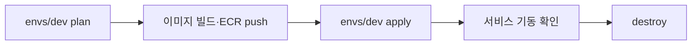

[지난 포스트](/posts/terraform-ecs-global-apply/)에서 `global`을 적용했다. 이번엔 `envs/dev`를 적용하고 서비스를 실제로 띄운다. 이 단계에서 **`validate`와 `plan`을 통과한 코드가 `apply`에서 깨지는 경험**을 여러 번 했다. 하나씩 정리한다.

---

## 순서



이미지를 먼저 올려야 하는 이유가 있다. ECS 서비스는 만들어지는 즉시 ECR에서 이미지를 받아 컨테이너를 띄우려 한다. 이미지가 없으면 태스크가 계속 실패하고 서비스는 배포 실패로 판단해 롤백을 반복한다.

---

## 1. envs/dev plan

```bash
cd infra/terraform/envs/dev
terraform init -backend-config=backend.hcl
terraform plan
```

### 에러 1: remote_state도 프로파일이 필요하다

`plan`이 이런 에러로 실패했다.

```
Error: No valid credential sources found
```

그런데 출력에는 `Plan: 51 to add`가 같이 찍혀 있었다. 에러가 stderr, 계획이 stdout으로 따로 나와서 성공한 것처럼 보였을 뿐, 실제로는 **exit 1로 실패한 계획**이었다. 이후 정상 계획은 67개였다. 종료 코드를 꼭 같이 봐야 한다는 교훈이다.

원인은 `global`의 state를 읽는 `terraform_remote_state`였다. backend처럼 provider와 별개로 자격증명을 찾는다.

```hcl
data "terraform_remote_state" "global" {
  backend = "s3"

  config = {
    bucket  = var.tfstate_bucket
    key     = "global/terraform.tfstate"
    region  = "ap-northeast-2"
    # provider 와 같은 프로파일을 쓴다 (null 이면 기본 체인)
    profile = var.aws_profile
  }
}
```

---

## 2. 이미지 빌드와 ECR push

Docker가 없는 환경이라 Jib로 레지스트리에 바로 올린다. 서비스 6개를 반복하는 스크립트를 만들었다.

```bash
AWS_PROFILE=terraform-study scripts/push-images.sh dev-v1
```

스크립트 핵심은 ECR 로그인 비밀번호를 Jib에 넘기는 부분이다.

```bash
PASSWORD="$(aws ecr get-login-password --region "$REGION")"

./gradlew ":apps:${svc}:jib" \
  -Djib.to.image="${REGISTRY}/terraform-study/${svc}:${TAG}" \
  -Djib.to.auth.username=AWS \
  -Djib.to.auth.password="$PASSWORD"
```

### 에러 2: Jib가 Java 25 클래스를 못 읽는다

```
> Task :apps:gateway:jib FAILED
Caused by: java.lang.IllegalArgumentException: Unsupported class file major version 69
```

버전 69는 **Java 25**다. Jib 3.4.5에 들어 있는 ASM 라이브러리가 이 버전의 클래스 파일을 읽지 못한다. Jib는 `mainClass`를 지정하지 않으면 클래스 파일을 훑어서 `main` 메서드를 가진 클래스를 찾는데, 이 과정에서 터진다.

해결은 **`mainClass`를 직접 지정**하는 것이다. 그러면 클래스를 훑지 않는다.

```kotlin
jib {
    container {
        mainClass = "com.genesisnest.user.UserApplication"
    }
}
```

고친 뒤에는 `jibBuildTar`로 먼저 검증했다. 이 태스크는 레지스트리에 올리지 않고 로컬에 tar만 만들어서, 실패해도 ECR을 건드리지 않는다.

---

## 3. envs/dev apply

```bash
terraform apply
```

약 8~15분 걸린다. NAT Gateway(2~3분)와 ALB(2~4분)가 오래 걸리고, `Still creating...`이 몇 분씩 반복되는 건 정상이다. 중간에 `Ctrl+C`로 끊으면 state와 어긋날 수 있다.

그런데 이 단계에서 에러가 두 개 났다.

### 에러 3: ALB 규칙의 host 조건에 `*`를 쓸 수 없다

```
Error: creating ELBv2 Listener Rule: ... ValidationError:
Condition value '*' contains a character that is not valid
```

도메인이 없어서 모든 host를 받으려고 `host_headers = ["*"]`로 썼는데, ALB는 `*` **한 글자만 있는 값**을 허용하지 않는다. `plan`에서는 이게 안 잡혔다. AWS가 실제 값을 받아 보는 순간에만 검증되는 종류다.

host 조건을 선택으로 만들고, 경로 조건으로 대체했다.

```hcl
# host 조건 (선택). 비어 있으면 만들지 않는다
dynamic "condition" {
  for_each = length(each.value.host_headers) > 0 ? [1] : []
  content {
    host_header { values = each.value.host_headers }
  }
}
```

```hcl
gateway = {
  host_headers  = []        # 도메인이 없으니 host 조건 없음
  path_patterns = ["/*"]    # 규칙에는 조건이 최소 1개 필요
}
```

### 에러 4: ECS 서비스 연결 역할이 아직 준비되지 않았다

```
ClientException: Failed to create Namespace
ECS Service Linked Role is not ready in customers account.
```

계정에서 ECS를 처음 쓰면, AWS가 `AWSServiceRoleForECS`라는 서비스 연결 역할을 **그 자리에서 자동으로 만든다.** 그런데 만들어지는 중에 클러스터를 만들려 하니 "준비 안 됨"이 뜬 것이다. 직접 만들어 보려 했더니 이미 있다는 메시지가 나왔다.

```
Service role name AWSServiceRoleForECS has been taken in this account
```

즉 **일시적인 타이밍 문제**였고, 잠깐 뒤 `apply`를 다시 실행하니 해결됐다. 이미 만들어진 리소스는 그대로 두고 남은 것만 만든다. Terraform의 이 멱등성 덕분에 에러를 만나도 안심하고 재실행할 수 있다.

---

## 4. 서비스 기동

처음 `apply`는 서비스를 `desired_count = 0`(컨테이너 없음)으로 만들었다. 이미지 push가 끝난 뒤 `terraform.tfvars`를 바꿨다.

```hcl
desired_count = 1
image_tag     = "dev-v1"
```

다시 `terraform apply`를 하면 이렇게 나온다.

```
Plan: 6 to add, 6 to change, 6 to destroy.
```

- 태스크 정의 6개가 교체된다 (이미지 태그가 바뀌어서 새 revision이 생긴다).
- 서비스 6개가 새 정의와 `desired_count = 1`로 변경된다.

### ignore_changes 이슈

원래 참고한 프로젝트의 `ecs-service` 모듈에는 이런 설정이 있다.

```hcl
lifecycle {
  ignore_changes = [task_definition, desired_count]
}
```

CI/CD가 배포할 때마다 새 태스크 정의를 만들어 서비스를 갱신하는데, `terraform apply`가 그걸 옛 버전으로 되돌리지 않게 하는 장치다. 하지만 이 프로젝트는 아직 CI 배포가 없고 `apply`로 이미지 태그를 바꾼다. 이 설정이 있으면 `apply`가 이미지 변경을 **무시**한다. `lifecycle`은 변수로 켜고 끌 수 없어서 아예 뺐다. CI 배포를 도입할 때 다시 넣을 예정이다.

### 에러 5: 잠깐 503이 난다

`apply` 직후 확인하니 gateway는 되는데 일부 서비스가 이렇게 나왔다.

```
/user -> no healthy upstream [503]
```

서비스 이벤트를 보니 태스크 하나가 이 에러로 멈춰 있었다.

```
CannotPullContainerError: ... terraform-study/user:dev-initial: not found
```

서비스를 갱신하는 순간 ECS가 옛 revision(`dev-initial` 이미지, ECR에 없다)으로 태스크를 하나 먼저 시도했다가 실패한 것이다. 이후 새 revision(`dev-v1`)으로 다시 띄웠고, **2~3분 뒤 자동으로 정상**이 됐다. 이미지 태그를 바꾸는 전환 구간에서 생기는 일시적 현상이라 코드 문제가 아니었다.

---

## 5. 동작 확인

서비스 상태를 CLI로 확인했다.

```bash
aws ecs describe-services --cluster terraform-study-dev-cluster \
  --services terraform-study-dev-gateway terraform-study-dev-user ... \
  --query 'services[].{name:serviceName,running:runningCount}' --output table
```

6개 서비스가 모두 `running 1`이 됐고, ALB 주소로 요청하니 이렇게 나왔다.

| 요청 | 응답 |
|---|---|
| `/` | `gateway-service` |
| `/user` | `user-service` |
| `/chatting` | `chatting-service` |
| `/session` | `session-service` |
| `/push` | `push-service` |

브라우저에서는 `http://<ALB 주소>/user`처럼 접속한다. 도메인과 인증서가 없어서 HTTPS 리스너를 만들지 않았으니 **`http://`로 직접** 입력해야 한다.

도메인을 연결하려면 ACM 인증서를 발급하고 ALB에 HTTPS 리스너를 붙이고 DNS에 CNAME을 거는 과정이 필요하다. 테스트 목적에서는 ALB가 주는 기본 주소로 충분했다.

---

## 6. 정리 (destroy)

NAT Gateway와 ALB는 켜져 있는 동안 계속 과금된다(합쳐서 시간당 수십 센트 수준). 확인이 끝나면 지운다.

```bash
cd infra/terraform/envs/dev && terraform destroy
cd ../../global && terraform destroy
```

지우는 순서는 **만든 순서의 반대**다. `envs/dev`가 `global`을 참조하니 dev를 먼저 지운다. ECR에 이미지가 남아 있으면 `global`의 `destroy`가 막히는데, 이때는 이미지를 먼저 지워야 한다.

---

## 이번에 배운 것

1. **`validate`와 `plan`이 통과해도 `apply`에서 깨진다.** AWS가 값을 실제로 받아 보는 에러(ALB 조건, 서비스 연결 역할 등)는 `apply`에서야 드러난다.
2. **에러의 종류를 구분해야 한다.** 코드 문제(ALB host 조건, Jib 설정)와 일시적인 타이밍 문제(서비스 연결 역할, 이미지 전환 503)는 대응이 다르다. 후자는 기다리고 재실행하면 된다.
3. **backend, `terraform_remote_state`, provider는 각각 자격증명을 찾는다.** 프로파일을 쓴다면 셋 다 넘겨야 한다.
4. **Terraform 재실행은 안전하다.** 이미 만든 건 그대로 두고 남은 것만 만든다.
5. **종료 코드를 같이 본다.** 에러와 계획이 함께 출력되면 성공처럼 보일 수 있다.

---

## 다음에 해볼 것

지금은 이미지를 손으로 올리고 있다. 실제 팀에서는 GitHub Actions가 이미지 빌드, ECR push, ECS 배포까지 자동으로 한다. 이미 `github-deploy-role`(OIDC 배포 role)을 Terraform으로 만들어 뒀으니, workflow만 추가하면 연결된다. 그때 `ignore_changes`를 다시 넣을 것이다.

➡️ 시리즈 인덱스: [Terraform으로 AWS ECS 서비스 배포하기](/posts/terraform-ecs-intro/)
