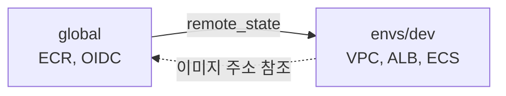
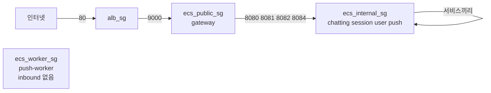

[지난 포스트](/posts/terraform-ecs-app)에서 앱을 만들었다. 이번엔 이걸 올릴 인프라를 **Terraform 코드로 어떻게 나눠 짤지** 정리한다. 코드를 쓰기 전에 구조부터 잡는 게 중요한 이유는, 나중에 바꾸기 가장 어려운 게 디렉터리 경계와 state 경계이기 때문이다.

---

## 세 덩어리로 나눈다

```
infra/terraform/
├── global/        # 계정 공통: ECR, GitHub OIDC provider
├── modules/       # 재사용 부품 8개 (단독 실행 안 함)
└── envs/dev/      # dev 환경: 모듈을 조합해서 실제로 만든다
```

| 디렉터리 | 역할 | `apply` 대상? |
|---|---|---|
| `global/` | 환경과 무관하게 한 번만 만드는 것 | O |
| `envs/dev/` | dev 환경 인프라 | O |
| `modules/*` | 재사용 부품 | **X** |

`modules`는 `apply`하지 않는다. `envs/dev`가 `module "network" { source = "../../modules/network" }` 처럼 불러 쓸 때 함께 만들어진다. 처음엔 이게 헷갈렸는데, 모듈은 함수, `envs/dev`는 그 함수를 호출하는 `main`이라고 생각하면 편하다.

---

## 왜 global과 envs를 나누나

**state를 분리하기 위해서**다. Terraform은 만든 리소스를 state 파일에 기록한다. 이 state가 하나로 합쳐 있으면 두 가지가 위험해진다.

- dev 환경을 `destroy`할 때 ECR(이미지 저장소)까지 같이 지워질 수 있다.
- stg, prd 환경을 추가하면 같은 ECR을 공유해야 하는데 dev state 안에 있어서 꺼내 쓸 수 없다.

그래서 ECR과 같이 **환경이 공유하는 것**은 `global`에 둔다. `envs/dev`는 `global`의 결과(ECR 주소, OIDC provider)를 `terraform_remote_state`로 읽는다. 이 때문에 **실행 순서가 정해진다: global → envs/dev**. 지울 때는 반대다.



---

## 모듈 8개

| 모듈 | 하는 일 |
|---|---|
| `network` | VPC, 서브넷, 인터넷 게이트웨이, NAT, 라우트 테이블 |
| `security-groups` | ALB / public / internal / worker 보안그룹과 규칙 |
| `iam-roles` | ECS 실행 role, 서비스 그룹별 task role |
| `logs` | 서비스별 CloudWatch 로그 그룹 |
| `alb` | ALB, 리스너, target group, 라우팅 규칙 |
| `ecs-cluster` | ECS 클러스터, Service Connect namespace |
| `ecs-service` | 태스크 정의 + ECS 서비스 (6번 호출) |
| `github-deploy-role` | GitHub Actions용 OIDC 배포 role |

`envs/dev`에서는 이 부품을 이렇게 호출한다. `ecs-service` 모듈 하나로 서비스 6개를 만든다.

```hcl
module "ecs_user" {
  source = "../../modules/ecs-service"

  name_prefix  = local.name_prefix
  service_name = "user"
  cluster_id   = module.ecs_cluster.cluster_id
  desired_count = var.desired_count

  subnet_ids         = module.network.private_app_subnet_ids
  security_group_ids = [module.security_groups.ecs_internal_sg_id]

  container_image = local.images["user"]
  container_port  = var.user_port

  # 다른 서비스가 http://user:8082 로 호출할 수 있게 등록
  service_connect_namespace_arn = module.ecs_cluster.service_connect_namespace_arn
  service_connect_service_name  = "user"
}
```

---

## 보안그룹: 누가 누구를 부를 수 있나

서비스마다 보안그룹을 따로 만들지 않고, **계층(tier) 단위로 4개**만 만든다.



핵심은 출발지를 **IP 대역이 아니라 보안그룹으로 지정**한다는 점이다.

```hcl
resource "aws_vpc_security_group_ingress_rule" "ecs_internal_from_public" {
  for_each = local.internal_ports   # chatting, session, user, push

  security_group_id = aws_security_group.ecs_internal.id
  # gateway가 속한 SG에서 오는 요청만 허용
  referenced_security_group_id = aws_security_group.ecs_public.id
  ip_protocol = "tcp"
  from_port   = each.value
  to_port     = each.value
}
```

이러면 task의 IP가 바뀌어도 규칙을 손볼 필요가 없다. 그리고 internal 서비스는 ALB에서도, 인터넷에서도 직접 닿지 않는다. 오직 gateway를 거쳐야 한다.

---

## 설계하면서 내린 결정들

### 1. 이미지 저장소(ECR)는 환경 공유, 태그로 구분

repository는 서비스당 하나(`terraform-study/user` 등)만 만들고, 환경은 태그 접두사(`dev-`, 나중에 `stg-`, `prd-`)로 나눈다. 태그는 `IMMUTABLE`로 해서 한 번 올린 태그는 덮어쓸 수 없게 했다. 덮어쓰려 하면 CI가 바로 실패해서 "어제 올린 이미지랑 다른 게 배포됨" 사고를 막는다.

### 2. 서비스 간 호출은 Service Connect

서비스끼리 `http://user:8082`처럼 **이름으로** 호출한다. ECS가 같은 namespace 안의 서비스를 찾아준다. 별도 로드밸런서나 서비스 디스커버리 서버(Eureka 등)를 안 둬도 된다.

### 3. 비용을 줄이는 선택

- **FARGATE_SPOT**: dev는 회수될 수 있는 Spot을 쓴다. 온디맨드보다 훨씬 싸다.
- **NAT Gateway 1개**: 원래는 AZ마다 두는 게 정석이지만, dev는 하나로 줄였다.
- **Container Insights 끔**: 추가 요금이 붙어서 테스트에선 껐다.

### 4. 계정 ID는 코드에 넣지 않는다

S3 버킷 이름에 계정 ID가 들어간다. 이 값이 git 이력에 남으면 곤란해서, `backend.tf`에는 버킷 줄을 아예 빼고 `init` 때 파일로 주입한다. 이 방식(partial configuration)은 다음 글에서 자세히 본다.

### 5. 모든 파일에 한 줄씩 주석

학습용이라 `.tf` 파일 전체에 한국어로 한 줄씩 주석을 달았다.

```hcl
resource "aws_subnet" "public" {
  # CIDR 개수만큼 서브넷을 만든다 (AZ 하나당 1개).
  count = length(var.public_subnet_cidrs)

  # 소속 VPC.
  vpc_id = aws_vpc.main.id
  # 여기서 뜨는 인스턴스에 공인 IP를 자동 부여한다.
  map_public_ip_on_launch = true
}
```

---

## 일부러 뺀 것

운영 환경 구성에는 DB, 캐시, 메시지 큐, WAF, 관측(Grafana 등)이 따라붙지만, 이 앱은 텍스트만 돌려주니 쓸 데가 없다. 빼서 코드를 가볍게 했다. 필요해지면 모듈을 추가하면 된다.

---

## 다음 글

구조를 잡았으니 이제 실제로 AWS에 적용한다. 다음 글에서는 AWS 로그인, state 버킷, 그리고 `global` 적용까지의 과정과 거기서 만난 에러를 다룬다.

➡️ 시리즈 인덱스: [Terraform으로 AWS ECS 서비스 배포하기](/posts/terraform-ecs-intro)
